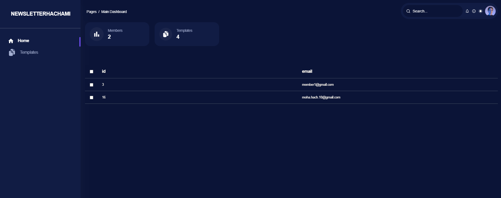
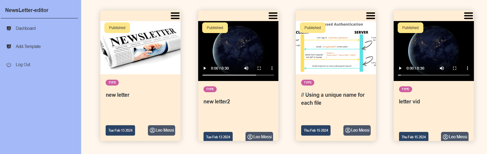
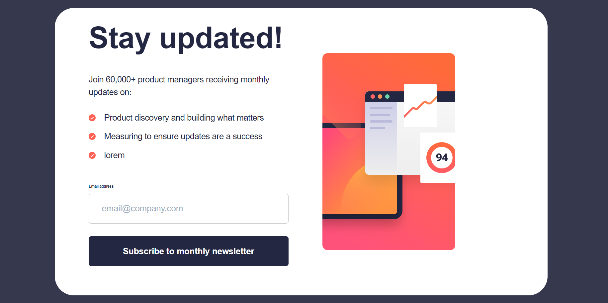

# Projet de Plateforme Web - Résumé

## Contexte

Notre client, une entreprise en pleine croissance dans le secteur de la communication et du marketing, a identifié un besoin crucial de centraliser et rationaliser ses opérations en ligne. Dans cette optique, l'entreprise a entrepris le développement d'une plateforme web interne avec des fonctionnalités avancées visant à améliorer la communication, la gestion de l'information et la collaboration au sein de son équipe.

## Stack Technologique

Le développement de cette plateforme a été réalisé en utilisant les technologies suivantes :
- Laravel (Backend)
- React (Frontend)
- Inertia.js(Frontend)

## Fonctionnalités Clés

### Gestion de Newsletter (Spatie Media)

- Mise en place d'une gestion avancée des newsletters.
- Possibilité d'ajouter des modèles de newsletter avec des médias spécifiques tels que des images, des vidéos (mp4), et des documents PDF.

### Authentification avec Gestion des Rôles (Policies et Guards)

- Utilisation du package Laratrust pour la gestion des rôles, des permissions, et des équipes.
- Authentification sécurisée avec des politiques (Policies) et des gardes (Guards) pour assurer un contrôle d'accès précis.

### Fonctionnalités Forgot Password et Remember Me

- Implémentation des fonctionnalités Forgot Password et Remember Me pour faciliter la gestion des identifiants et des sessions utilisateur.

### Soft Delete

- Intégration de la fonctionnalité Soft Delete permettant à l'administrateur d'archiver les modèles de newsletter plutôt que de les supprimer définitivement.

### Middleware

- Utilisation de middlewares pour vérifier les rôles des utilisateurs et les rediriger vers des tableaux de bord spécifiques en fonction de leurs autorisations.

### Modélisation avec 3 Rôles

- Conception d'une base de données permettant de prendre en charge trois rôles distincts : Administrateur, Rédacteur, Membre.
- Chaque rôle dispose de tables et de relations spécifiques, assurant une séparation claire des données et des responsabilités au sein de la plateforme.

## Screens à Présenter

En tant que développeur, je prévois de créer et de présenter des captures d'écran pour les différentes parties de l'application, notamment :
- **Admin Dashboard**
  


- **Editor Dashboard**
  

- **Client Page**
  


Ces écrans illustreront visuellement l'interface utilisateur et les fonctionnalités spécifiques de chaque tableau de bord et de la page client.

## Getting Started

These instructions will help you set up and run the project on your local machine.

### Prerequisites

- PHP
- Composer
- Node.js
- npm

### Clone the Repository

```bash
git clone https://github.com/Youcode-Classe-E-2023-2024/HACHAMI_Med_NEWSLETTER.git
cd HACHAMI_Med_NEWSLETTER
```
```bash
npm install
composer install
```
```bash
php artisan migrate
php artisan serve
npm run dev
```


